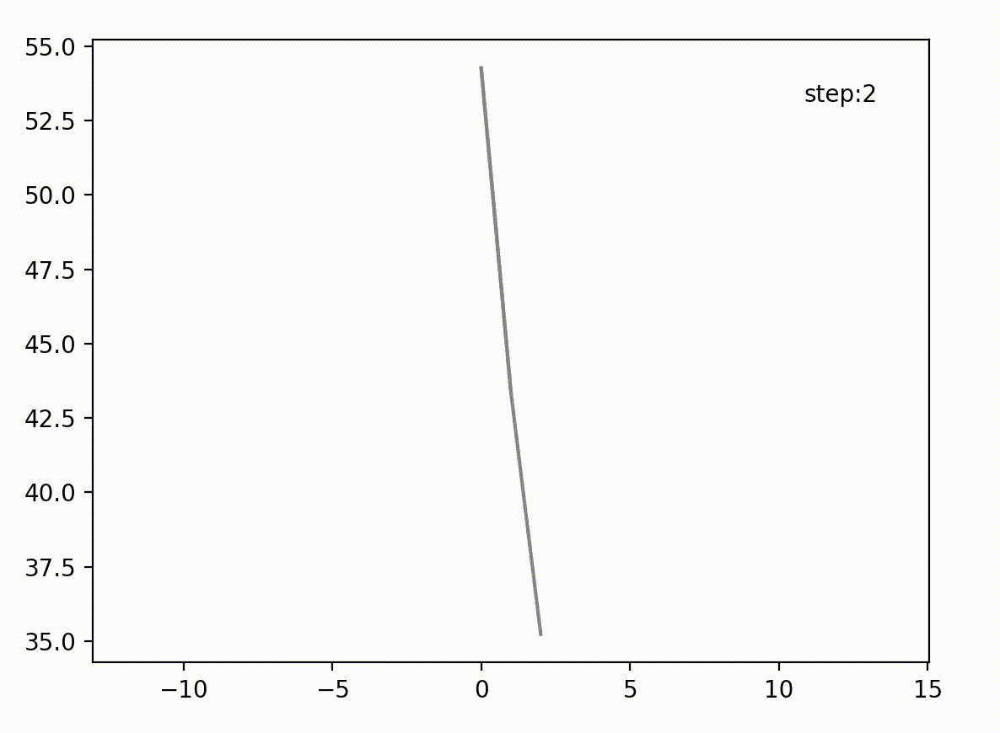
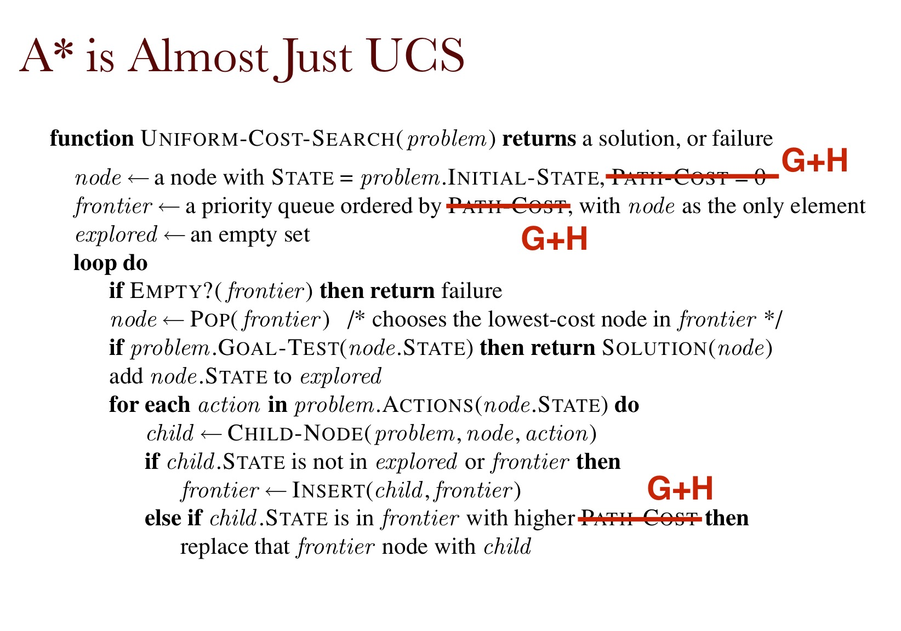

# Optimization-and-Search
Implementation and visualization of optimization algorithms.  
please add __MAthJax Plugin for Github__ to your browser.

# Table of Contents
- [Optimization-and-Search](#optimization-and-search)
- [Table of Contents](#table-of-contents)
- [1. Numerical Optimization](#1-numerical-optimization)
  - [Gradient Descent](#gradient-descent)
  - [Conjugate Descent](#conjugate-descent)
  - [Newton Method](#newton-method)
- [2. Stochastic Search](#2-stochastic-search)
  - [Simulated Annealing](#simulated-annealing)
  - [Cross-Entropy Methods](#cross-entropy-methods)
  - [Search Gradient](#search-gradient)
- [3. Classical Search](#3-classical-search)
  - [A* search algorithm (A star search algorithm)](#a-search-algorithm-a-star-search-algorithm)
  - [minimax search](#minimax-search)
- [4. Dynamic Programming](#4-dynamic-programming)
  - [Value iteration](#value-iteration)
  - [Policy iteration](#policy-iteration)
- [5.](#5)
  - [Monte Carlo Policy Evaluation](#monte-carlo-policy-evaluation)
  - [Temporal Difference Policy Evaluation](#temporal-difference-policy-evaluation)
  - [Tabular Q learning](#tabular-q-learning)
- [6.](#6)
  - [Deep Q learning](#deep-q-learning)
- [7.](#7)
  - [Monte Carlo Tree Search](#monte-carlo-tree-search)
- [8.](#8)
  - [DPLL](#dpll)

# 1. Numerical Optimization    

Here we are trying to solve simple quadratic problem.  
$$\arg \text{min } \frac{1}{2}x^TQx + b^Tx$$
$$Q \geq 0, x \in R^n$$    

The animation(left) is tested on N=10, (right) for n=2;

## Gradient Descent   
using first-order gradient and learning rate

## Conjugate Descent    
$x^{k+1} := x^k + a_kd^k$  
using line search to compute the step size $\alpha$  
$$a_k = \frac{\nabla f(x^k)^Td^k}{(d^k)^TQd^k}$$  
find conjugate direction  
$$d^{k+1} = -\nabla f(x^{k+1}) + \beta_kd^k$$    
$$ \beta_k = \frac{\nabla f(x^{k+1})^T\nabla f(x^{k+1})}{\nabla f(x^k)^T\nabla f(x^k)} \text{ (FR)}$$ 

## Newton Method   
using second-order gradient  
$x^{k+1} := x^k + d^k$  
$d^k = -[\nabla^2 f(x^k)]^{-1}\nabla f(x^k)$

# 2. Stochastic Search    
Here we try to use stochastic search to solve TSP problems.  
## Simulated Annealing    

## Cross-Entropy Methods   
cross entropy using less steps to get converged

## Search Gradient   
Here trying to find lowest position. Since for TSP, I cannot find $\nabla_\theta \log (p_\theta (z_i))$. If you have any idea please be free to comment. Thanks!

# 3. Classical Search    

## A* search algorithm (A star search algorithm)   
The code is writen according to the slide in CSE257, UCSD.

## minimax search

# 4. Dynamic Programming
## Value iteration

The implementation here, the reward for all the tile is -0.04, and credit tile is 4, obstable tile is -5.  
You can just press space key to change the [credit] or [obstable] choice and click left to add credit/obstable tile and remove them.  

**We can see we get the optimal policy before our utility function converges.**

## Policy iteration

# 5. 
## Monte Carlo Policy Evaluation  
- Policy: $\pi (s_i) = a_i$
- Trajectories: $s_0, s_1, s_2, .., s_T$
- Rewards: $R(s_0) + \gamma R(s_1) + .. + \gamma^TR(s_T)$

Follow policy and get a lot of samples of trajectories, and estimate the expectation
$$V^{\pi}(s_0) = \mathbb{E}_\pi [\sum_{i=0}^T\gamma^iR(s_i)]$$
## Temporal Difference Policy Evaluation  

The difference between TD and MC method is that TD could update in every step and do not necessarily wait for a whole trajectory to generate.

Note that the learning rate $\alpha$ should decrease with the number of visits to a state, in this case the method is guaranteed to converge to the true action values by the law of large numbers.

## Tabular Q learning

**Off policy method**
$$V(s) = \max_a (\mathbb{E}[R(s)+\gamma V(s'|s,a)])$$

# 6. 
## Deep Q learning
In this case I used Deep Q network to train a self-driving car. The environment is created by NeuralNine (github), thought he used NEAT package to train the car.   
The demo is below: you can modify the network and train your own car!   
Random case:

DQL case:

# 7. 
## Monte Carlo Tree Search

# 8.
## DPLL

